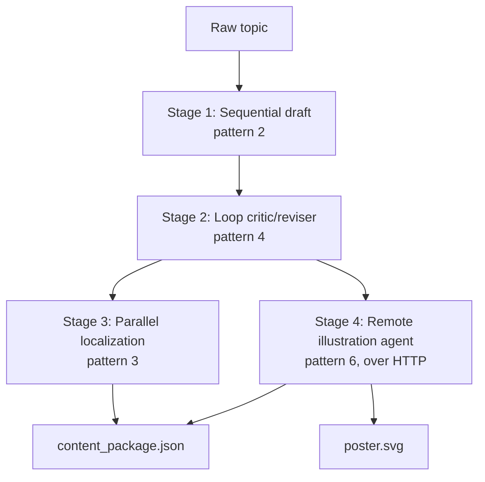

# Capstone -- Cymbal Stadiums Marketing Content Studio

This is the real use case the whole repo has been building toward. See
[`docs/03-use-case-marketing-studio.md`](../../docs/03-use-case-marketing-studio.md)
for the full narrative and requirements; this README covers just running it.

## What it does

Give it a raw idea (e.g. *"our excellent on-the-job training"*) and it
produces a finished **content package**:



1. **Sequential draft** -- look up brand guidelines and the audience
   persona, then write a first draft. Fixed order: writing can't start
   before research finishes.
2. **Loop critic/reviser** -- a critic checks the draft against brand
   voice and asks for a rewrite if it's too generic; repeats (capped)
   until approved.
3. **Parallel localization** -- once approved, translate into Spanish,
   French, and German *at the same time*, since none of those three needs
   the others.
4. **Agent-to-agent call** -- ask the illustration agent (patterns/06),
   running as its own separate process, for a poster -- exactly the way
   you'd call a service owned by another team.

Stages 3 and 4 both depend on stage 2's approved draft, but not on each
other -- in a more advanced version you'd literally fan them out together
(one thread pool worker doing localization, another doing the remote
illustration call). This version runs them one after the other for
clarity; extending it to overlap them is a good class exercise.

## Run it

Terminal 1 -- start the illustration agent (reused as-is from pattern 6):

```bash
pip install -r requirements.txt
PYTHONPATH=. uvicorn illustration_agent_service:app --app-dir patterns/06_agent_to_agent_http --port 8001
```

Terminal 2 -- run the studio:

```bash
PYTHONPATH=. python capstone/marketing_content_studio/studio.py
PYTHONPATH=. python capstone/marketing_content_studio/studio.py "our new safety certification program" external
```

Output lands in `capstone/marketing_content_studio/output/`:
- `content_package.json` -- the approved copy, all three localized
  versions, and where the poster is
- `poster.svg` -- open it in a browser

## Things to point out in class

- **No single "agent" does everything.** The system's intelligence is
  spread across a handful of small, single-purpose calls, each wired
  together by plain Python control flow you can read top to bottom in
  `studio.py`. That's usually a better production design than one giant
  agent with a huge prompt and a dozen tools -- easier to test, debug, and
  reason about failure in isolation.
- **Failure domains are visible.** If the illustration agent is down,
  `illustrate_remote` raises `httpx.ConnectError` and the whole run stops
  *after* producing an approved, localized draft -- nothing upstream is
  wasted. Ask the class: how would you change this so a poster failure
  doesn't block shipping the text? (Hint: make stage 4 best-effort and
  degrade gracefully instead of raising.)
- **This is "agentic AI" in the way it actually shows up in industry**:
  not one clever autonomous loop, but sequencing, parallelism, iteration,
  and service boundaries, each applied where it fits -- with one or two
  LLM calls doing genuinely judgment-based work (drafting, critiquing) and
  everything else being ordinary, deterministic orchestration code.
- Try swapping `MAX_CRITIQUE_ITERATIONS`, adding a fourth language, or
  making the illustration call run in parallel with localization
  (`ThreadPoolExecutor` again, now with two different *kinds* of task in
  the same pool) as extensions.
