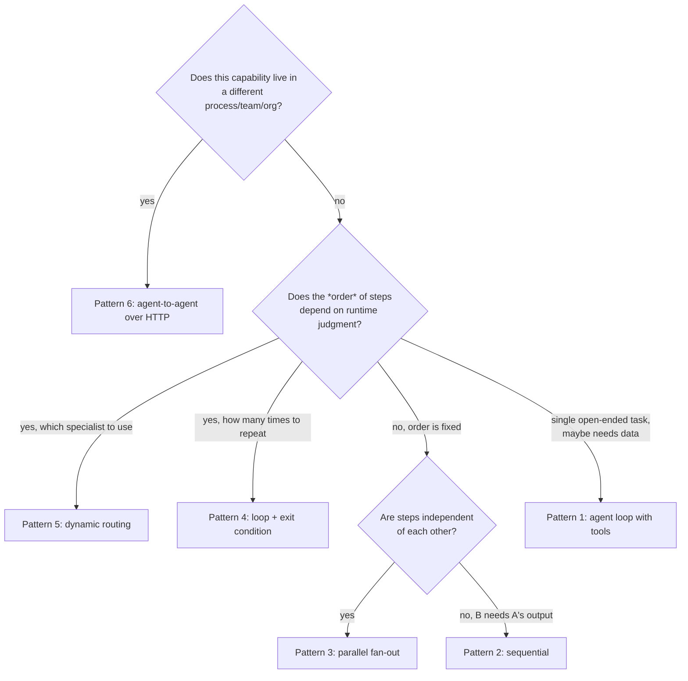

# 2. Pattern Catalog

A side-by-side reference for all six patterns and where the capstone uses
each one. Read top to bottom for a suggested teaching order -- each
pattern builds on an idea from the one before it.

| # | Pattern | One-line idea | Control flow | Process boundary | Code |
|---|---|---|---|---|---|
| 1 | Agent loop with tools | Model decides, turn by turn, whether to call a tool or answer | Dynamic | In-process | [`patterns/01_agent_loop_with_tools/`](../patterns/01_agent_loop_with_tools/) |
| 2 | Sequential pipeline | Fixed chain: A's output feeds B | Deterministic | In-process | [`patterns/02_sequential_pipeline/`](../patterns/02_sequential_pipeline/) |
| 3 | Parallel fan-out/fan-in | Independent sub-tasks run at once, then merge | Deterministic | In-process | [`patterns/03_parallel_fanout/`](../patterns/03_parallel_fanout/) |
| 4 | Loop with exit condition | Critic/reviser cycle until approved or capped | Dynamic (when to stop), fixed (where to go) | In-process | [`patterns/04_loop_critic_reviser/`](../patterns/04_loop_critic_reviser/) |
| 5 | Dynamic multi-agent routing | Orchestrator picks *which* specialist handles a request | Dynamic | In-process | [`patterns/05_dynamic_multi_agent_routing/`](../patterns/05_dynamic_multi_agent_routing/) |
| 6 | Agent-to-agent over HTTP | Discover a remote agent's card, then call its task endpoint | Deterministic call, remote logic opaque | **Cross-process** | [`patterns/06_agent_to_agent_http/`](../patterns/06_agent_to_agent_http/) |

## Decision guide: which pattern do I need?

Ask these questions, roughly in order:



## How the capstone composes them

The [capstone](../capstone/marketing_content_studio/) is not a seventh
pattern -- it's proof that patterns 2, 3, 4, and 6 compose cleanly into
one real pipeline:

```
research_and_draft()      <- Pattern 2 (sequential)
        |
        v
critique_and_revise()     <- Pattern 4 (loop)
        |
        +---------------------+
        v                      v
   localize()             illustrate_remote()
   Pattern 3 (parallel)   Pattern 6 (agent-to-agent, HTTP)
```

Patterns 1 and 5 aren't part of the capstone's fixed pipeline, but they
answer a real question the capstone doesn't: *"what if the incoming
request isn't always 'write slide copy'?"* Pattern 5's router is exactly
what you'd put in front of the capstone to decide whether a request needs
the full studio pipeline, a quick social post (pattern 5's own
specialists), or a one-off answer from the brand assistant (pattern 1).
That's a good extension exercise -- see
[05-teaching-guide.md](05-teaching-guide.md).

## Terminology map (this repo -> common framework names)

| This repo calls it... | Google ADK | LangGraph | Roughly also known as |
|---|---|---|---|
| Agent loop with tools | `LlmAgent` + function tools | a tool-calling node with a conditional edge back to itself | ReAct |
| Sequential pipeline | `SequentialAgent` | a linear graph | chain, workflow |
| Parallel fan-out | `ParallelAgent` | fan-out edges + a join node | map-reduce, fan-out/fan-in |
| Loop + exit condition | `LoopAgent` (exits via `escalate`) | a cyclic graph with a conditional exit edge | reflection, critic-actor |
| Dynamic multi-agent routing | `LlmAgent` with `sub_agents` (transfer) | a router/supervisor node | orchestrator-worker, supervisor pattern |
| Agent-to-agent over HTTP | `RemoteA2aAgent` / `to_a2a()` | (framework-agnostic; usually a custom HTTP tool) | A2A, remote agent, multi-agent-as-a-service |

Next: [03-use-case-marketing-studio.md](03-use-case-marketing-studio.md)
for the full narrative behind the capstone.
