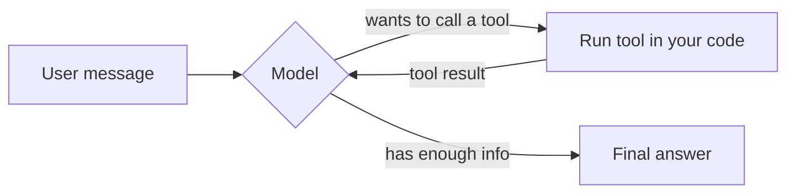

# Pattern 1 -- Agent Loop with Tools

**The one pattern all the others are built from.**

## The idea

An "agentic" system is not just "call an LLM." It's a loop:



1. Send the model the conversation so far, plus a list of tools it's
   allowed to call (each tool is just a Python function with a JSON-schema
   description).
2. The model replies with either plain text (done) or a request to call
   one or more tools.
3. Your code actually runs the tool (the model never executes anything
   itself) and appends the result to the conversation.
4. Go back to step 1. Repeat until the model stops asking for tools.

This is often called the **ReAct** pattern (Reason + Act). It's what makes
an LLM "agentic" rather than a one-shot text generator: the model decides,
turn by turn, whether it has enough information to answer or needs to go
gather more.

## What's in `agent.py`

A `brand_assistant` that answers "how should I apply our brand to X?"
questions. It has two tools:

- `lookup_brand_guidelines` -- real brand colors/voice/imagery rules
- `lookup_audience_persona` -- who the content is actually for

The system prompt explicitly tells it *not* to invent brand details --
forcing it to use the tools is what keeps the answer grounded in your
actual source of truth instead of the model's imagination.

## Run it

```bash
pip install -r requirements.txt
PYTHONPATH=. python patterns/01_agent_loop_with_tools/agent.py
```

You'll see a trace like:

```
[..] system                       user -> brand_assistant: What imagery and colors...
[..] brand_assistant              -> calling tool 'lookup_brand_guidelines'({"topic": "poster"})
[..] brand_assistant              <- 'lookup_brand_guidelines' returned {...}
[..] brand_assistant              -> calling tool 'lookup_audience_persona'({"audience": "external"})
[..] brand_assistant              <- 'lookup_audience_persona' returned {...}
[..] brand_assistant              final answer on turn 2
```

Try your own question:

```bash
PYTHONPATH=. python patterns/01_agent_loop_with_tools/agent.py "How should I talk about our internal training program?"
```

With `LLM_PROVIDER=mock` (the default) the answer is scripted so you can
study the *loop*, not the model's writing. Set `LLM_PROVIDER=openai` or
`LLM_PROVIDER=anthropic` in `.env` (with an API key) to see a real model
decide, on its own, which tools to call and in what order.

## Things to point out in class

- **Nothing here is framework magic.** `MAX_TURNS`, the `while`/`for` loop,
  and the tool dispatch dictionary are nine lines of plain Python. Agent
  frameworks (LangGraph, ADK, CrewAI, ...) give you this loop pre-built
  plus retries, streaming, tracing, etc. -- but it's the same idea.
- **The model never runs code.** It only ever asks, by name, for a
  function to be called with certain arguments. Your process decides
  whether that's safe to do (this matters a lot once tools can write
  files, send emails, spend money, ...).
- **`MAX_TURNS` is a safety valve.** Without it, a model that keeps
  deciding "I need one more lookup" runs forever and keeps billing you.
  Every pattern in this repo has some form of a loop bound.
- Compare `assistant_message_from_response` / `tool_result_message` in
  `common/llm.py` for OpenAI vs. Anthropic -- the *loop* above is
  identical for both vendors, but the wire format for "here's a tool
  result" is not. That's the seam a framework normally hides from you.
