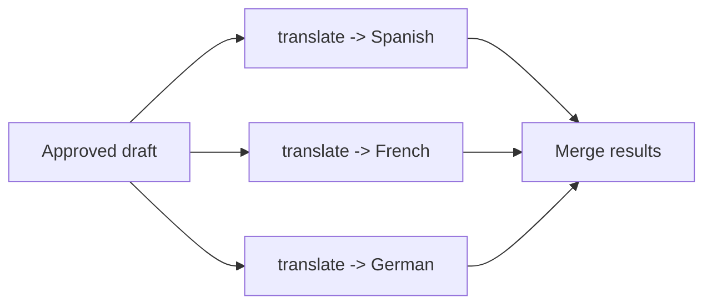

# Pattern 3 -- Parallel Fan-Out / Fan-In

## The idea



Three translation calls that don't depend on each other at all -- so run
them at the same time instead of one after another. Fan the work out
across a thread pool, then fan it back in by collecting each result.

## When to reach for this

Use it whenever you can answer **"could sub-task B start before sub-task
A finishes?"** with **yes** for every pair of sub-tasks. If any sub-task
needs another's output, you have Pattern 2 (sequential), not this.

Classic real examples: translating into N languages, asking several
retrieval sources the same question and merging results, running multiple
independent quality checks on one draft, generating N variations to pick
the best one.

## Run it

```bash
PYTHONPATH=. python patterns/03_parallel_fanout/pipeline.py
```

Watch the timestamps in the trace: all three `translator:*` "translating
into..." lines print almost immediately, and all three "done" lines land
together roughly `_SIMULATED_LATENCY_SECONDS` later -- not stacked up
`3 x` that.

## Things to point out in class

- **Why threads, not `asyncio`, here:** LLM API calls spend nearly all
  their time waiting on the network, so Python's GIL is a non-issue --
  `ThreadPoolExecutor` gets you the same wall-clock win as `asyncio` with
  code every student can already read. Swap in `asyncio.gather` once the
  class is comfortable with `async`/`await`.
- **Fan-in is a real design decision.** Here it's just "collect a dict
  keyed by language" -- but in other systems fan-in means picking the
  best of N results, voting, or merging conflicting answers. That merge
  step is where a lot of production bugs hide.
- **One slow branch slows the whole fan-in.** `as_completed` still has to
  wait for the *last* future. If one language's model call hangs, the
  whole batch hangs with it -- worth pairing this pattern with a
  per-call timeout in real systems.
