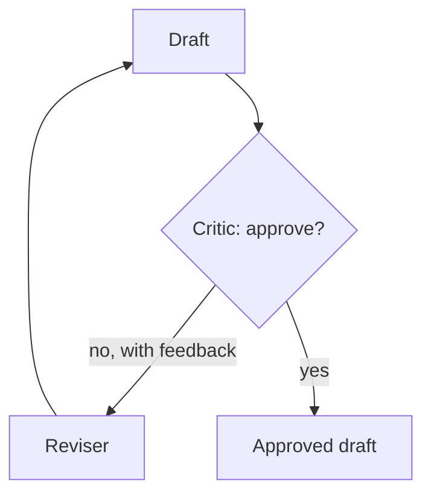

# Pattern 4 -- Loop with an Exit Condition (Critic/Reviser)

## The idea



A `while`/`for` loop around two roles: a **critic** that judges the
current draft and either approves it or explains what's wrong, and a
**reviser** that rewrites the draft using that feedback. The loop repeats
until the critic approves -- with a hard `MAX_ITERATIONS` cap so a critic
that's never satisfied can't loop forever and run up your bill.

This is the same shape as a code-review cycle, or a `while not
tests_pass(): fix(); run_tests()` loop -- just with an LLM playing each
role.

## Why two separate roles instead of one "improve this" call?

You could ask a single model call to "improve this draft" repeatedly, but
splitting critique from revision has a real advantage for teaching (and in
production): the **exit condition is explicit and inspectable**. You can
log every verdict, see exactly why iteration 1 failed, and prove to a
skeptical reviewer that the loop didn't just run a fixed number of times
by coincidence.

## Run it

```bash
PYTHONPATH=. python patterns/04_loop_critic_reviser/pipeline.py
```

With the default mock critic, watch it take exactly 2 iterations: the
first draft is "generic corporate praise" (rejected), the revision adds a
concrete "wrench" image (approved).

## Things to point out in class

- **`MAX_ITERATIONS` is not optional.** Every loop pattern in agentic
  systems needs a hard exit besides "the model says it's happy" --
  models can get stuck disagreeing with themselves.
- **The exit condition here is a string prefix (`"APPROVE:"` vs.
  `"REVISE:"`).** That's intentionally fragile, to make a teaching point:
  parsing free text for a control-flow decision is brittle. In production
  you'd ask for structured output (a JSON `{"approved": true/false, ...}`
  or a dedicated `approve_draft` / `request_changes` tool call) instead of
  string-matching a prefix -- try that as a class exercise.
- Compare this to Pattern 5: there, the model chooses *which agent* to run
  next; here, the model (the critic) only chooses *whether to loop again*.
  Both are "the model deciding," but the range of decisions is much
  narrower here -- narrower decisions are easier to make reliable.
