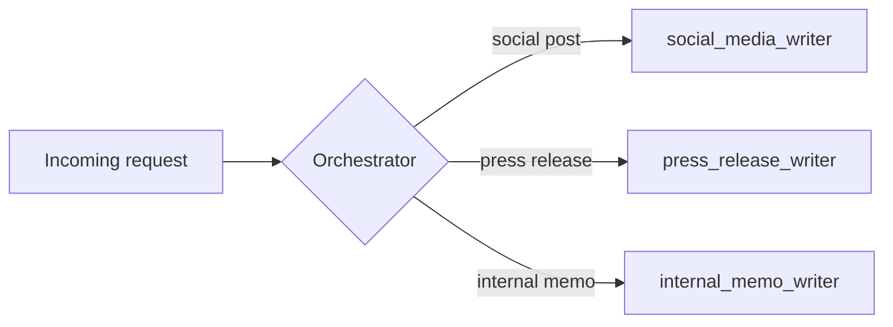

# Pattern 5 -- Dynamic Multi-Agent Routing (Orchestrator / Handoff)

## The idea



One orchestrator agent whose only job is to look at a request and decide
**which specialist should handle it** -- by calling a "handoff" tool named
after that specialist. This looks like Pattern 1 (a tool-calling loop),
but the "tools" here are entire other agents, and the point isn't to
gather information -- it's to pick a path through the system at runtime.

## How this differs from every other pattern here

| Pattern | Who decides the path? | Fixed at code time? |
|---|---|---|
| 2. Sequential | You | Yes -- always A then B |
| 3. Parallel | You | Yes -- always run all branches |
| 4. Loop | The critic decides *when to stop*, not *where to go* | Path is fixed, iteration count isn't |
| **5. Routing** | **The model, per request** | **No -- different requests take different paths** |

This is the pattern to reach for when requests genuinely vary in kind and
you don't want to write `if "press release" in text: ... elif "memo" in
text: ...` by hand (brittle, and it's exactly the kind of judgment call
LLMs are good at). The mock orchestrator in this file *does* use a crude
keyword check, on purpose -- to make the point that a real model call
replaces that `if/elif` chain with a judgment call that generalizes far
past a fixed keyword list.

## Run it

```bash
PYTHONPATH=. python patterns/05_dynamic_multi_agent_routing/orchestrator.py
PYTHONPATH=. python patterns/05_dynamic_multi_agent_routing/orchestrator.py "we need a press release about the training program"
PYTHONPATH=. python patterns/05_dynamic_multi_agent_routing/orchestrator.py "send the team a memo about the new schedule"
```

Try all three example requests and watch the trace show a different
specialist being called each time from the exact same code path.

## Things to point out in class

- **The orchestrator never writes content itself** -- its system prompt
  explicitly forbids it. Keeping "decide who" and "do the work" as
  separate agents makes each one's job simpler and its behavior easier to
  evaluate independently.
- This is the in-process version of a much bigger idea: what if the
  specialist you're routing to isn't a Python function in the same file,
  but a completely separate service, maybe run by another team? That's
  exactly Pattern 6 (agent-to-agent over HTTP) -- routing and remote
  invocation are complementary, and the capstone shows them combined.
- A production version of this orchestrator would validate that the model
  called *exactly one* handoff tool, handle the "it called zero tools"
  and "it called two tools" cases explicitly, and probably log every
  routing decision for later review -- routing mistakes are silent
  failures (wrong content shows up, nothing crashes).
