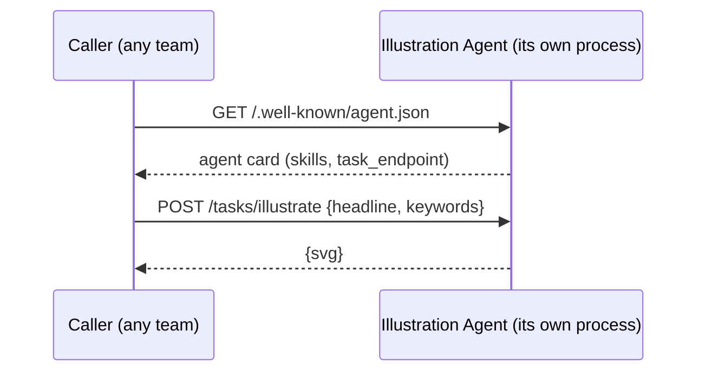

# Pattern 6 -- Agent-to-Agent (A2A) Communication over HTTP

## The idea



Every pattern before this one ran entirely inside one Python process. That
works when one team owns the whole system. It stops working the moment a
capability needs to be:

- **owned and deployed independently** (the illustration team ships fixes
  without anyone else redeploying),
- **reused by multiple callers** who don't share a codebase,
- or **built in a different stack** than the caller (the agent could be
  Python, the caller Java -- HTTP + JSON doesn't care).

The fix is the same one distributed systems have always used: put a
network boundary between them, and agree on a protocol. Two pieces make
that protocol *agentic* rather than just "a REST API":

1. **Discovery** -- `GET /.well-known/agent.json` returns an **agent
   card**: a small JSON document describing what this agent can do
   (`skills`) and how to invoke it (`task_endpoint`). A caller (or an LLM
   orchestrator acting on a caller's behalf) can decide whether this agent
   is useful *without* a human reading its source code first.
2. **Task invocation** -- `POST /tasks/illustrate` sends the actual
   work and gets a result back.

## This vs. the real A2A protocol

This file is a **from-scratch, simplified teaching version** of the idea
behind Google's [Agent2Agent (A2A) protocol](https://a2aproject.github.io/A2A/)
-- built with plain FastAPI so every byte on the wire is visible, since
this repo's whole point is "no framework." The real spec adds things this
version deliberately skips for clarity:

| This teaching version | Real A2A protocol |
|---|---|
| One synchronous POST per task | Task *objects* with IDs, states (`submitted`, `working`, `completed`), polling or streaming for long-running work |
| Plain JSON body | JSON-RPC 2.0 envelope |
| No auth | Auth schemes declared in the agent card |
| Ad hoc `AGENT_CARD` dict | Formal `AgentCard` schema (capabilities, auth, input/output modes, ...) |

If a project needs the real thing, look at Google's official
[`a2a-sdk`](https://github.com/a2aproject/A2A) (Python) and, if you're
building on Google's Agent Development Kit, its `RemoteA2aAgent` /
`to_a2a()` helpers, which implement this spec directly. The mental model
you just learned here (agent card -> discover -> invoke a task) carries
over unchanged.

## Run it

Terminal 1 -- start the illustration agent as its own process:

```bash
pip install -r requirements.txt
PYTHONPATH=. uvicorn illustration_agent_service:app --app-dir patterns/06_agent_to_agent_http --port 8001
```

Terminal 2 -- call it from a separate process:

```bash
PYTHONPATH=. python patterns/06_agent_to_agent_http/client.py
```

Open the agent card directly in a browser or with curl to see the raw
discovery response:

```bash
curl -s http://localhost:8001/.well-known/agent.json | python -m json.tool
```

The client saves `poster.svg` next to itself -- open it in a browser to
see the (deliberately simple, offline, zero-cost) generated poster.

## Things to point out in class

- **The two processes never import each other's code.** The only thing
  they share is the HTTP contract. That's the whole benefit: either side
  can be rewritten in a different language tomorrow and nothing on the
  other side has to change, as long as the agent card and task shape stay
  the same.
- **`generate_poster_svg` (`common/svg_poster.py`) is a stand-in for a
  real image-generation API call** (Imagen, DALL-E, Gemini image, ...).
  Swapping it for a real model call is a one-function change *inside the
  agent* -- the caller's code in `client.py` would not need to change at
  all. That's the real payoff of a stable interface.
- Compare to Pattern 5: routing there picks between in-process Python
  functions; this pattern is what routing looks like once the destination
  is a completely separate service. The capstone combines both.
